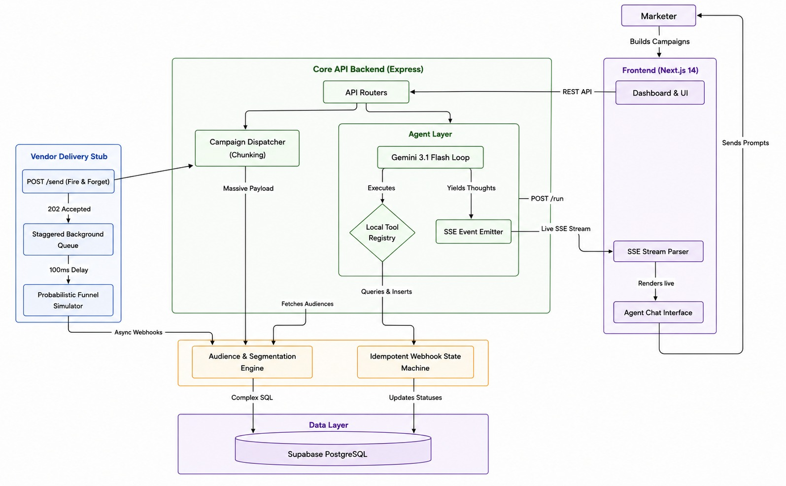
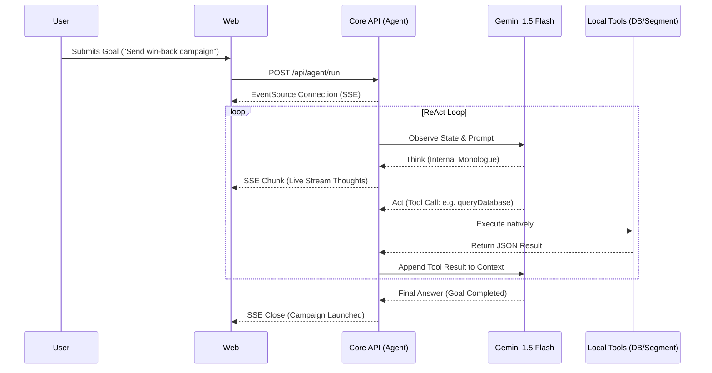

# 🤖 XenoCRM — Autonomous AI Campaign Agent

**Xeno Engineering Internship Assignment 2026**

XenoCRM is an AI-native Mini CRM built to handle end-to-end marketing campaigns autonomously. Instead of manually clicking through filters to segment users and draft emails, a marketer simply types a goal (e.g., *"Send a win-back discount to Silver tier customers inactive for 60 days"*). 

The CRM uses a **Gemini ReAct Agent** to reason, segment the audience, draft personalized cross-channel messages, and launch the campaign. A separate **Channel Stub** simulates real-world delivery latency and failures across WhatsApp, SMS, Email, and RCS.

---

## 🌟 Key Features

1. **Autonomous ReAct Loop:** Gemini 3 Flash agent that reasons, acts, and observes using custom function-calling tools.
2. **Live SSE Streaming:** The frontend streams the agent's "thought process" live via Server-Sent Events, so the marketer can watch the AI work in real-time.
3. **Idempotent Delivery Webhooks:** The CRM exposes a `/api/receipt` endpoint governed by a strict state-machine (Sent → Delivered → Opened → Clicked) that rejects out-of-order callbacks.
4. **Vendor Channel Stub:** A fully separate Express service that simulates 4-channel delivery. It uses `setTimeout` to introduce probabilistic latency and enforces a 10% failure rate to simulate real-world bounce mechanics.
5. **Auto-Retry Mechanics:** The agent can observe failed deliveries and autonomously launch a retry campaign on an alternate channel.
6. **Robust Authentication:** Full authentication provided by Clerk.
7. **Interactive Dashboard & Delivery Funnel:** Beautiful Next.js frontend with live funnel metrics and AI-driven campaign builder.

---

## 🏗️ Detailed System Architecture



XenoCRM operates on a decoupled, microservice-inspired monorepo architecture. This design cleanly separates the user interface, the core business logic, and external integrations.

### 1. The Frontend Application (`apps/web/`)
* **Technology:** Next.js 14 App Router, React, Tailwind CSS, Clerk Authentication.
* **Role:** Acts as the primary control surface for the marketer. 
* **Key Components:**
  * **Real-time Dashboards:** Utilizes `recharts` to render live RFM metrics and funnel performance.
  * **Agent Interface:** Implements an `EventSource` connection to stream Server-Sent Events (SSE) from the backend, parsing and rendering the Agent's thought logs natively as they are emitted.
  * **Campaign Wizard:** A multi-step complex state machine that guides users through manual campaign creation.
* **Data Fetching:** Relies strictly on client-side and server-side HTTP calls to the Core API Backend. It does not speak directly to the database.

### 2. The Core API Backend (`apps/api/`)
* **Technology:** Node.js, Express, TypeScript, Supabase/PostgreSQL.
* **Role:** The brain of the operation. It orchestrates all business logic and houses the Gemini ReAct agent.
* **Key Responsibilities:**
  * **Audience Engine:** Converts JSON filter rules into complex PostgreSQL queries (using Supabase). Evaluates recency, frequency, and monetary parameters dynamically.
  * **Campaign Dispatcher:** When a campaign launches, the backend generates unique communication records for every targeted user, binds personalized variables, and chunks the HTTP payloads dispatched to the Vendor Stub.
  * **Webhook Processor:** Implements strict validation and state-machine transitions for incoming webhooks on `/api/receipt`.

### 3. The Vendor Stub Simulator (`apps/stub/`)
* **Technology:** Node.js, Express, TypeScript.
* **Role:** An isolated, mocked external network (similar to Twilio or SendGrid).
* **Key Responsibilities:**
  * **Asynchronous Processing:** Immediately accepts massive inbound payloads with a `202 Accepted` to prevent blocking the Core API.
  * **Probabilistic Funnels:** Uses pseudo-random distribution to simulate realistic bounce rates (e.g. 10% failure) and engagement metrics (e.g. read/clicked ratios).
  * **Network Jitter:** Implements randomized `setTimeout` delays between webhook callbacks to simulate network latency and unpredictable delivery times.

### 4. Shared Infrastructure (`packages/shared/`)
* Contains the centralized SQL Schema definitions and a robust seeding pipeline that generates thousands of realistic customer rows with corresponding order histories.

---

## 🧠 Agent Architecture (Gemini ReAct Loop)

The most advanced component of XenoCRM is the Autonomous Agent, built on the **ReAct (Reason + Act)** paradigm using the `@google/genai` SDK. It doesn't just execute predefined scripts; it "thinks" about the problem and dynamically chooses which tools to execute.



### The ReAct Loop
When the marketer submits a prompt, the Agent enters a `while(true)` loop inside `apps/api/src/agent/runner.ts`:
1. **Observe State:** Evaluates the initial user prompt and previous conversational history.
2. **Think:** The model outputs an internal monologue (e.g., *"I need to find customers who haven't bought in 60 days. I should use the `queryDatabase` tool first."*)
3. **Act:** The model halts generation and requests a Tool Call.
4. **Execute:** The Node.js backend intercepts the tool call, executes the requested function natively (e.g., querying Supabase), and appends the JSON result to the conversation context.
5. **Repeat:** The model is invoked again with the new context. It evaluates if the goal is complete. If yes, it breaks the loop and returns a final response.

### Custom Tool Repertoire
The agent is equipped with highly specific, sandboxed tools:
* `queryDatabase`: Allows the agent to run read-only analytical queries against the customer base to understand the data shape.
* `createSegment`: The agent can define specific filter rules (e.g., `tier = 'Silver' AND last_order_days > 60`) to lock in an audience.
* `draftMessage`: The agent generates personalized multi-channel copy using dynamic merge tags (e.g., `{name}`).
* `launchCampaign`: Once the audience and message are finalized, the agent can autonomously trigger the dispatch pipeline.

### Live Streaming (Server-Sent Events)
To build trust, the Agent is entirely transparent. As the `while(true)` loop executes, the backend emits `chunk` events via SSE to the Next.js frontend. The user sees the agent typing its thoughts, visualizing loading states for tool executions, and finally presenting the completed campaign, all in real-time.

---

## 🚀 Local Setup Instructions

### 1. Prerequisites
- Node.js (v18+)
- A [Supabase](https://supabase.com) account (for PostgreSQL)
- A [Clerk](https://clerk.com) account (for Auth)
- A [Google AI Studio](https://aistudio.google.com/) API key (for Gemini)

### 2. Database Setup
1. Create a new Supabase project.
2. Run the SQL schema located at `packages/shared/schema.sql` in the Supabase SQL Editor.

### 3. Environment Variables
You need to create 3 `.env` files:

**`apps/api/.env`**
```env
SUPABASE_URL=your_supabase_url
SUPABASE_SERVICE_KEY=your_supabase_service_role_key
SUPABASE_ANON_KEY=your_supabase_anon_key

GEMINI_API_KEY=your_gemini_api_key

STUB_URL=http://localhost:4000
CRM_RECEIPT_URL=http://localhost:3001/api/receipt
API_INTERNAL_URL=http://localhost:3001
PORT=3001
```

**`apps/web/.env.local`**
```env
NEXT_PUBLIC_CLERK_PUBLISHABLE_KEY=your_clerk_publishable_key
CLERK_SECRET_KEY=your_clerk_secret_key

NEXT_PUBLIC_CLERK_SIGN_IN_URL=/sign-in
NEXT_PUBLIC_CLERK_SIGN_UP_URL=/sign-up
NEXT_PUBLIC_CLERK_AFTER_SIGN_IN_URL=/dashboard
NEXT_PUBLIC_CLERK_AFTER_SIGN_UP_URL=/dashboard

NEXT_PUBLIC_API_URL=http://localhost:3001
```

**`apps/stub/.env`**
```env
CRM_RECEIPT_URL=http://localhost:3001/api/receipt
PORT=4000
```

### 4. Install & Seed
Install all dependencies across the monorepo:
```bash
npm install
```

Run the seed script to populate the database with 500 customers, 2000+ orders, and calculate their RFM (Recency, Frequency, Monetary) scores:
```bash
node packages/shared/seed.js
```

### 5. Run the Services
You need 3 terminal windows to run the services simultaneously:

**Terminal 1: Web Frontend**
```bash
cd apps/web
npm run dev
```

**Terminal 2: CRM API**
```bash
cd apps/api
npx ts-node-dev --respawn --transpile-only src/index.ts
```

**Terminal 3: Channel Stub**
```bash
cd apps/stub
npx ts-node-dev --respawn --transpile-only src/index.ts
```

Open `http://localhost:3000` in your browser.

---

## 🧠 System Design Tradeoffs

### Volume & Ordering
To prevent the vendor stub from overwhelming the CRM receipt API with thousands of concurrent requests, the stub processes recipients in **batches of 50**, staggered by 100ms. 
To ensure chronological integrity (e.g. preventing a "delivered" status from overwriting an "opened" status due to network jitter), the CRM `/api/receipt` endpoint implements a strict **State Machine**. Out-of-order state transitions are rejected. Furthermore, database operations for fetching large segments are heavily chunked to prevent URL length limits in standard REST/fetch clients.

### Idempotency
Each message sent to the stub is assigned a unique `stub_message_id`. This ID is passed back in all webhooks, allowing the CRM to confidently update the communications table without risking duplicate records during network retries.

### Production Scaling Considerations
For a rapid assignment, `setTimeout` and synchronous DB writes are acceptable. At real-world scale (millions of users):
1. **Message Broker:** The API would push campaigns to a Kafka topic or SQS queue, rather than calling the stub synchronously.
2. **Dead Letter Queues (DLQ):** Failed receipt webhooks would be pushed to a DLQ for asynchronous replay.
3. **Connection Pooling:** We would implement PgBouncer in front of Supabase to handle thousands of concurrent webhook DB connections.
