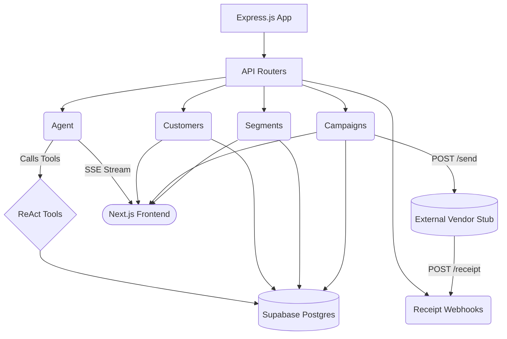

# ⚙️ XenoCRM — Core API Backend

This is the central Express.js backend for XenoCRM. It serves as the primary brain of the platform, responsible for orchestrating the PostgreSQL database, handling dynamic campaign generation, processing webhooks from the vendor stub, and housing the autonomous Gemini ReAct Agent.

---

## 🛠️ Technical Stack

* **Core Framework:** Node.js + Express.js
* **Language:** TypeScript (Strict Mode)
* **Database Client:** `@supabase/supabase-js` (PostgreSQL)
* **AI Provider:** `@google/genai` (Gemini 1.5 Flash)
* **Real-time Comms:** Server-Sent Events (SSE)

---

## 🌟 Architecture & Deep Dive



### 1. The Autonomous ReAct Agent (`src/agent/runner.ts`)
The true differentiator of XenoCRM is the built-in Gemini Agent, which operates using the **Reason + Act (ReAct)** paradigm.
* **The Loop:** When triggered, the agent enters an autonomous `while` loop. It observes its current context, outputs a "thought" process, and executes registered local tools.
* **Tool Calling Execution:** The agent doesn't just return JSON; it actively pauses execution, tells the Node.js backend to fire functions like `queryDatabase` (executing read-only SQL) or `createSegment`, and ingests the result back into its context window.
* **Live SSE Streaming:** Because autonomous loops can take 10-30 seconds to run, the backend parses the raw agent stream and emits custom Server-Sent Event (SSE) chunks. The UI receives real-time updates as the agent types out its thoughts or executes tools, dramatically improving perceived latency.

### 2. Audience Engine & Segmentation
The backend acts as a compiler that translates JSON-based filter rules into complex PostgreSQL database queries via Supabase.
* **Dynamic Resolution:** A segment is just a set of rules (e.g., `tier = 'Silver'` and `last_order_days > 60`). When a campaign launches, the backend dynamically resolves this segment in real-time, ensuring that if a user just made a purchase 5 seconds ago, they are automatically excluded from the "inactive" segment.
* **Array Chunking:** To prevent massive segments from exceeding REST body limits or URL parameter limits, the API intelligently slices huge audience arrays into manageable chunks before executing bulk inserts into the `communications` table.

### 3. Campaign Dispatcher
When a campaign launches (`/api/campaigns/:id/send`), the backend:
1. Fetches the exact resolved audience.
2. Iterates over the audience to generate uniquely identifiable `communications` rows.
3. Injects custom merge tags (e.g., replacing `{name}` with "John") into the message template.
4. Groups the outbound messages by channel and dispatches them in a massive fire-and-forget `POST` request to the Vendor Stub.

### 4. Idempotent Webhooks & The State Machine
The `/api/receipt` webhook endpoint is incredibly robust, designed to handle thousands of incoming requests from the Vendor Stub.
* **Strict State Machine:** A message must flow through the exact pipeline: `queued` → `sent` → `delivered` → `read/opened` → `clicked`.
* **Latency Resilience:** Because networks are unpredictable, a `delivered` webhook might arrive *after* a `read` webhook. The API checks the state machine graph and completely ignores out-of-order webhooks to prevent overwriting advanced states with older ones.
* **Revenue Attribution:** When a "clicked" webhook is successfully processed, the API simulates an order placement using probabilistic math. If triggered, it instantly updates the campaign's `revenue_generated` column, closing the marketing loop.

---

## 📡 Exhaustive API Routes Reference

### Customers (`/api/customers`)
* `GET /api/customers` - Fetches a paginated list of all customers, supporting sorting and basic filtering.
* `GET /api/customers/stats` - Calculates massive aggregate statistics (Total platform revenue, RFM tier distributions, active vs lapsed ratios).
* `GET /api/customers/cities` - Plucks distinct cities for frontend filter dropdowns.
* `GET /api/customers/rfm/scatter` - Returns highly optimized pairs of Recency/Frequency coordinates, specifically formatted for Recharts scatter plots.
* `GET /api/customers/:id` - Fetches a single customer's deeply nested profile, including recent orders.
* `POST /api/customers/ingest` - Accepts bulk arrays of new customers for CRM ingestion.

### Segments (`/api/segments`)
* `GET /api/segments` - Returns all persisted audience segments.
* `POST /api/segments` - Persists a new segment with complex JSON filter logic.
* `POST /api/segments/preview` - Executes a dry-run of a segment rule, returning the exact count of matched customers without persisting the segment.
* `GET /api/segments/:id/customers` - Returns the actual, materialized array of customers that match the segment rules.
* `DELETE /api/segments/:id` - Deletes a segment.

### Campaigns (`/api/campaigns`)
* `GET /api/campaigns` - Fetches all campaigns with their metadata.
* `POST /api/campaigns` - Initializes a new, empty draft campaign.
* `GET /api/campaigns/:id` - Fetches full details for a specific campaign.
* `GET /api/campaigns/:id/stats` - Groups and counts the `communications` table to return live funnel stats (e.g., 500 Sent, 450 Delivered, 300 Read).
* `GET /api/campaigns/:id/communications` - Returns the individual, raw message logs for every recipient targeted by the campaign.
* `POST /api/campaigns/:id/send` - The trigger endpoint that commits the campaign, resolves the segment, and dispatches payloads to the Vendor Stub.
* `DELETE /api/campaigns/:id` - Deeply deletes a campaign, automatically cascading to its associated communications.

### AI Agent (`/api/agent`)
* `POST /api/agent/run` - Initializes a new autonomous ReAct session, assigning it a UUID and returning it to the client.
* `GET /api/agent/runs` - Lists all historical agent runs.
* `GET /api/agent/runs/:id` - Retrieves a specific historical run.
* `GET /api/agent/stream/:runId` - **(SSE Endpoint)** The client establishes an EventSource connection here to receive a continuous stream of live thought logs, tool executions, and final results.

### Webhooks (`/api/receipt`)
* `POST /api/receipt` - The mission-critical ingestion endpoint for the Vendor Stub. It processes standard delivery receipts and executes the state-machine logic.

---

## 🚀 Running the API

1. Ensure your `.env` is set up with Supabase and Gemini keys (see root `README.md`).
2. Install dependencies: `npm install`
3. Run the development server (auto-restarts on changes):
```bash
npm run dev
```
4. The server runs on port `3001` by default.
