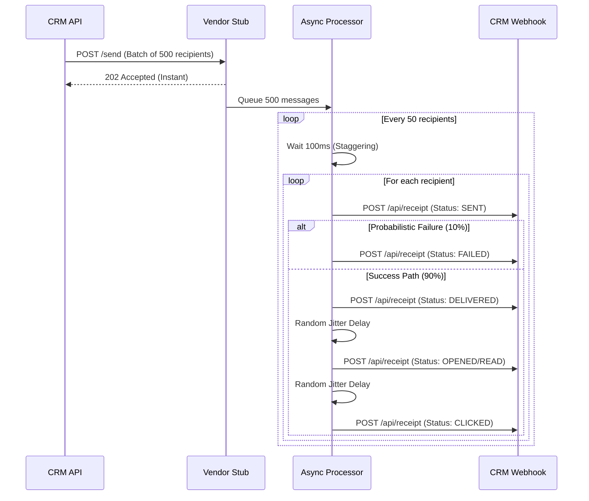

# 📡 XenoCRM — Vendor Channel Stub

This is a standalone Express.js service built entirely to act as an external vendor delivery simulator. It heavily mocks the behavior of real-world enterprise messaging services like Twilio, SendGrid, Gupshup, or the WhatsApp Business API.

---

## 🛠️ Purpose & Philosophy

In a true production CRM architecture, you do not directly deliver emails or SMS yourself. You compile an enormous payload of messages and POST them to a third-party vendor. That vendor accepts the payload immediately, queues the messages internally, and over the course of the next few hours, fires asynchronous **Webhooks** back to your CRM to update the message statuses (Sent → Delivered → Bounced → Opened → Clicked).

This **Stub** perfectly mimics that exact asynchronous, webhook-heavy architecture locally on your machine. It allows XenoCRM to test the robustness of its state machines without relying on real API keys, rate limits, or incurring monetary costs.

---

## 🌟 Core Architecture & Deep Dive



### 1. Fire-and-Forget Ingestion
The `/send` endpoint is incredibly lightweight. When XenoCRM sends a campaign for 10,000 users, the Stub immediately accepts the JSON payload and drops the HTTP connection with a `202 Accepted` response. It then pushes the entire payload into an isolated background Node.js Event Loop. This ensures the Core API is never blocked waiting for network delivery.

### 2. Batching, Queuing & Staggering
If the Stub instantly fired 10,000 webhooks back to the local CRM API, it would crash the Node.js process and exhaust the database connection pool. 
To prevent this, the Stub implements a strict **Staggered Queuing Mechanism**:
* It slices the massive array of recipients into smaller chunks (e.g., batches of 50).
* It utilizes `setTimeout` to introduce an artificial 100ms delay between processing each batch.
* This mimics real-world network throughput constraints and protects the CRM from self-inflicted DDoS attacks.

### 3. Advanced Probabilistic Funnels
The Stub doesn't just blindly return `delivered`. It uses Math algorithms to simulate a chaotic, real-world marketing funnel:
* **Failure Rates:** It enforces a ~10% absolute failure rate, instantly firing a `FAILED` webhook to simulate hard bounces or invalid phone numbers.
* **Success Decay:** Of the messages that succeed, not all are opened. The Stub enforces typical industry open rates (e.g., 60% Open Rate, 20% Click Rate). 
* **Channel Specifics:** It understands the differences between mediums. For example, `email` fires `opened` events, while `whatsapp` and `rcs` fire `read` events.

### 4. Randomized Network Jitter
In reality, a customer might click a link 5 seconds after receiving an SMS, or 5 hours later. The Stub implements **Randomized Jitter** between every state transition. It might take 100ms to go from `sent` to `delivered`, but it might take 800ms to go from `delivered` to `read`. This forces the Core CRM API to handle heavily staggered, chaotic webhook traffic.

---

## 📡 API Routes Reference

### `POST /send`
The sole inbound endpoint for the Core CRM API to dispatch outbound campaigns.

**Request Payload Example:**
```json
{
  "channel": "whatsapp",
  "recipients": [
    { "id": "msg_abc123", "to": "+123456789", "content": "Hello World!" },
    { "id": "msg_xyz987", "to": "+987654321", "content": "Hello World!" }
  ]
}
```

**Response:** Returns `202 Accepted` immediately. All subsequent updates are fired asynchronously to the CRM's `/api/receipt` webhook endpoint.

---

## 🚀 Running the Stub

1. Ensure your `.env` is set up with the CRM receipt URL (see root `README.md`).
2. Install dependencies: `npm install`
3. Run the development server:
```bash
npm run dev
```
4. The server runs on port `4000` by default.
