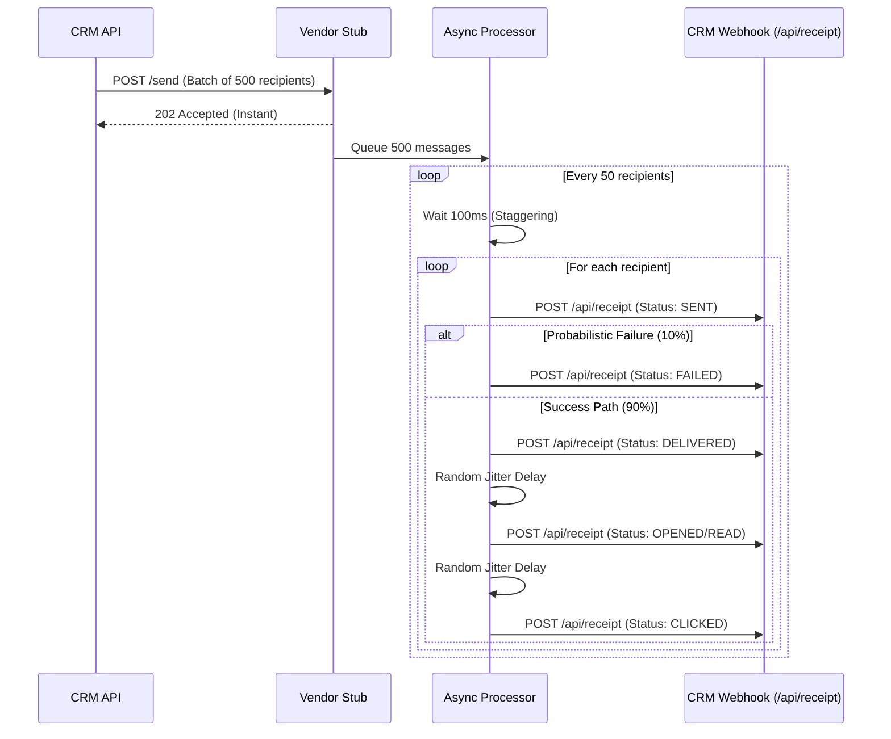

# 📡 XenoCRM — Vendor Channel Stub

This is a standalone Express.js service that acts as an external vendor delivery simulator (mocking services like Twilio, SendGrid, or WhatsApp Business API). 

## 🛠️ Purpose

In a real-world CRM architecture, when a campaign is launched, the CRM pushes messages to an external vendor. The vendor then asynchronously fires webhooks back to the CRM to update the message status (e.g., delivered, bounced, read).

This **Stub** perfectly mimics that behavior locally, allowing us to test the entire lifecycle and the CRM's state machine without relying on actual third-party API keys or incurring costs.

## 🌟 Key Features



### 1. **Batching & Staggering**
When the CRM launches a campaign for 500 customers, it hits the Stub with a single large payload. 
To prevent overwhelming the CRM with 500 simultaneous webhook callbacks, the Stub buffers the recipients and processes them in **batches of 50**. It staggers the delivery of each batch using `setTimeout` to mimic realistic network latency and rate-limiting constraints.

### 2. **Probabilistic Funnel Simulation**
The Stub doesn't just return "delivered" for every message. It programmatically simulates a real-world delivery funnel based on the communication channel:
* **Failure Rate:** Enforces a ~10% absolute failure rate to simulate hard bounces or invalid numbers.
* **Channel Specifics:** 
  * `email`: Only fires `sent`, `delivered`, `opened`, and `clicked`.
  * `whatsapp` / `rcs` / `sms`: Fires `sent`, `delivered`, `read`, and `clicked`.
* **Latency Jitter:** Each state transition happens with randomized jitter (e.g., a message might take anywhere from 100ms to 800ms to transition from `delivered` to `read`).

### 3. **Fire-and-Forget Architecture**
The `/send` endpoint immediately accepts the payload and closes the HTTP connection with a `202 Accepted` response. All webhook callbacks are then fired entirely in the background.

## 📡 API Routes Reference

### `POST /send`
The primary endpoint where the core CRM API sends outbound messages. 

**Request Payload Example:**
```json
{
  "channel": "whatsapp",
  "recipients": [
    { "id": "uuid-1", "to": "+123456789", "content": "Hello World!" },
    { "id": "uuid-2", "to": "+987654321", "content": "Hello World!" }
  ]
}
```

**Response:** Returns `202 Accepted` immediately, and begins processing webhooks asynchronously in the background.

## 🚀 Running the Stub

1. Ensure your `.env` is set up with the CRM receipt URL (see root `README.md`).
2. Install dependencies: `npm install`
3. Run the development server:
```bash
npm run dev
```
4. The server runs on port `4000` by default.
